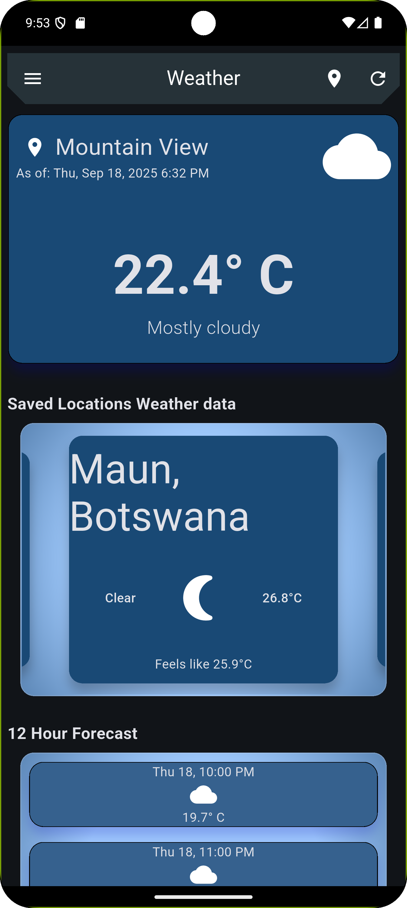
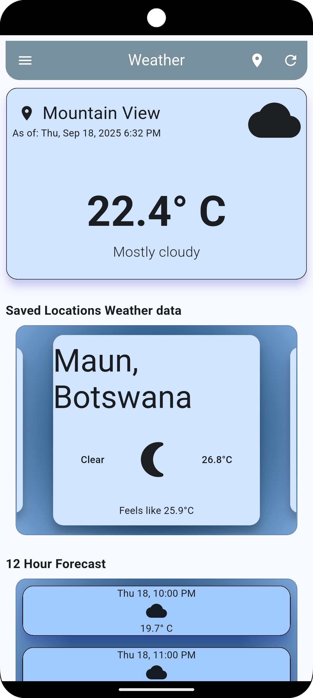
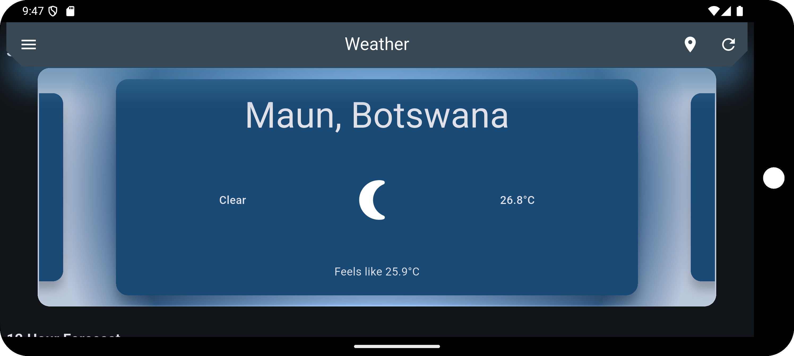
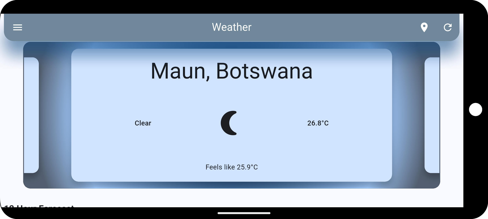
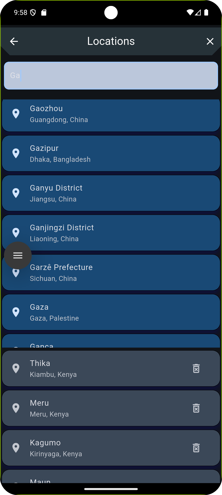
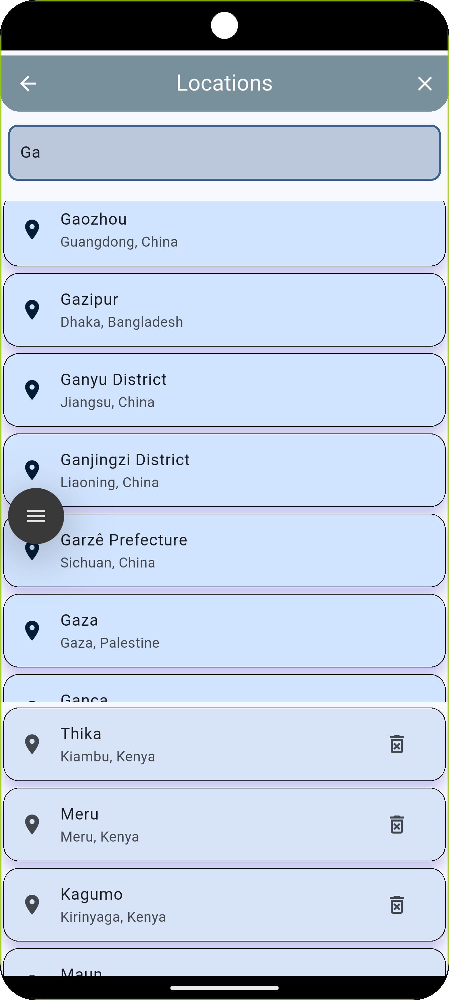
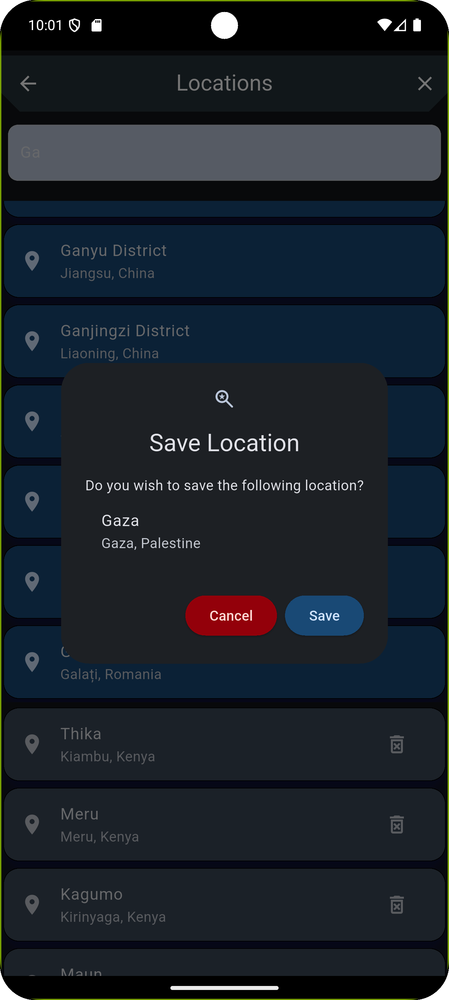
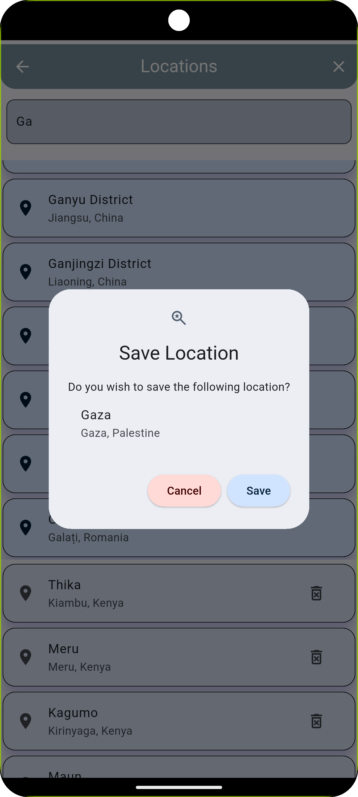

<!--   -->


# Weather 2.0

This is a project similar to the original Weather app (click
this **[link](https://github.com/Mak-Lobo/weather-flutter)** to see the original) but with a simpler,
intuitive and more modern UI.

The project achieves it purpose through the following:

- **[AccuWeather](https://developer.accuweather.com/)** API to fetch weather data,
  currently using the free trial until 23rd of September, 2025.
- **[Sqflite](https://pub.dev/packages/sqflite)** to store the saved locations of interest.

- **[Riverpod](https://pub.dev/packages/riverpod)** for state management.

- **[Dio](https://pub.dev/packages/dio)** for HTTP requests.

- **[Location](https://pub.dev/packages/location)** for geolocation.

- **[SpinKit](https://pub.dev/packages/spinkit)** for loading indicators.

- **[GoRouter](https://pub.dev/packages/go_router)** for navigation.

***App preview***
------------------------------

1. **Home**
______

| Dark theme Portrait                                        | Light Theme Portrait                                         |
|------------------------------------------------------------|--------------------------------------------------------------|
|  |  |
___
| Dark theme Landscape                                          | Light Theme Landscape                                           |
|---------------------------------------------------------------|-----------------------------------------------------------------|
|  |  |


2. **Locations**

| Dark theme Portrait                                                | Light Theme Portrait                                                 |
|--------------------------------------------------------------------|----------------------------------------------------------------------|
|  |  |

3. **Saved Locations**

| Dark theme Portrait                                                    | Light Theme Portrait                                                     |
|------------------------------------------------------------------------|--------------------------------------------------------------------------|
|  |  |

___

### Configuration

The project has the AccuWeather API key and base URL stored in the `.env` file. Create the file in the parent directory with
the structure below:

```
API_Key = <API_KEY>
BaseURL = <BASE_URL>
```
**Note:** Obtain a valid API key from [AccuWeather](https://developer.accuweather.com/).

### Installation
- Clone the repository
- Configure as described above
- Run `flutter pub get`
- Run `flutter run`
